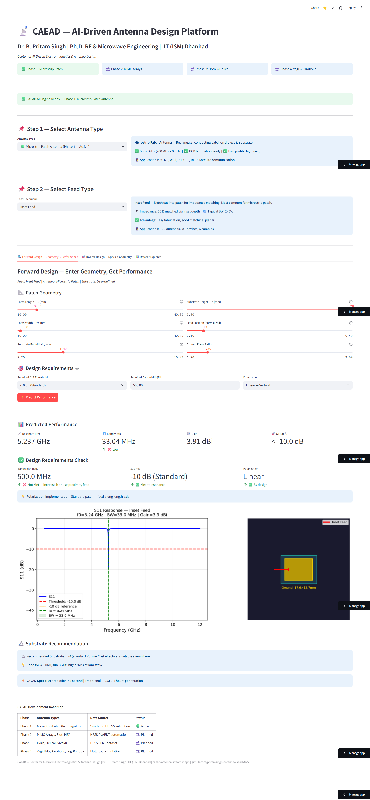
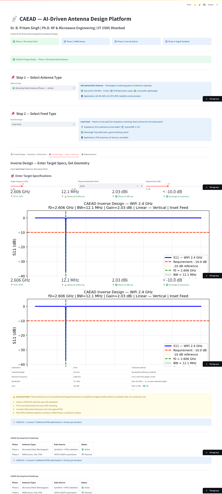
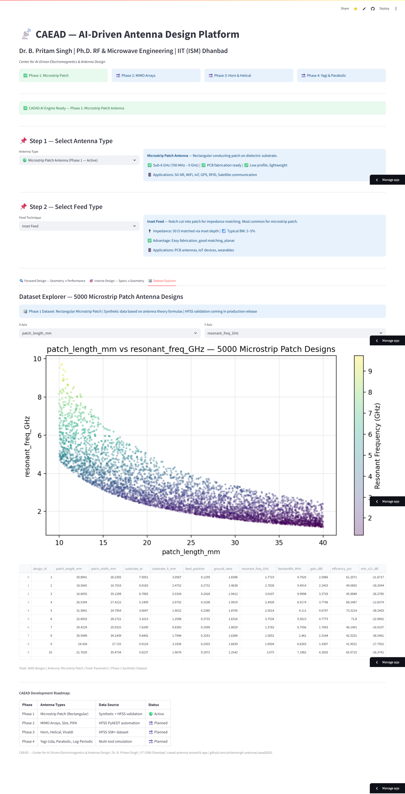
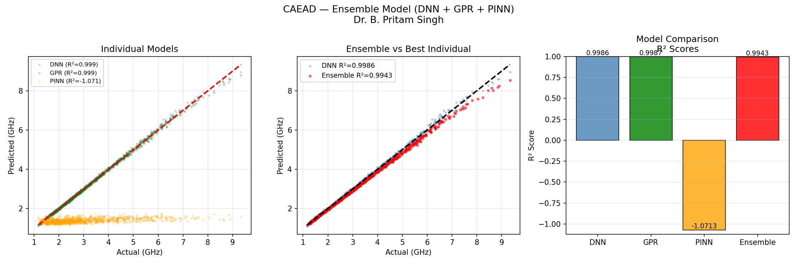
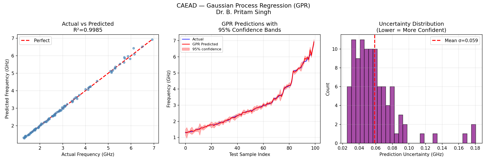
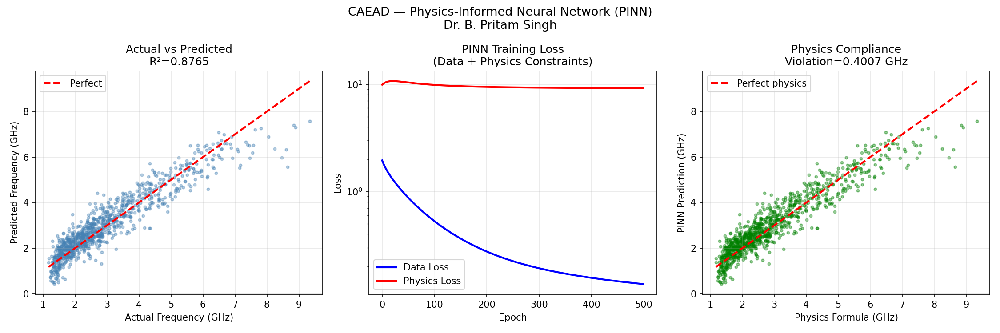
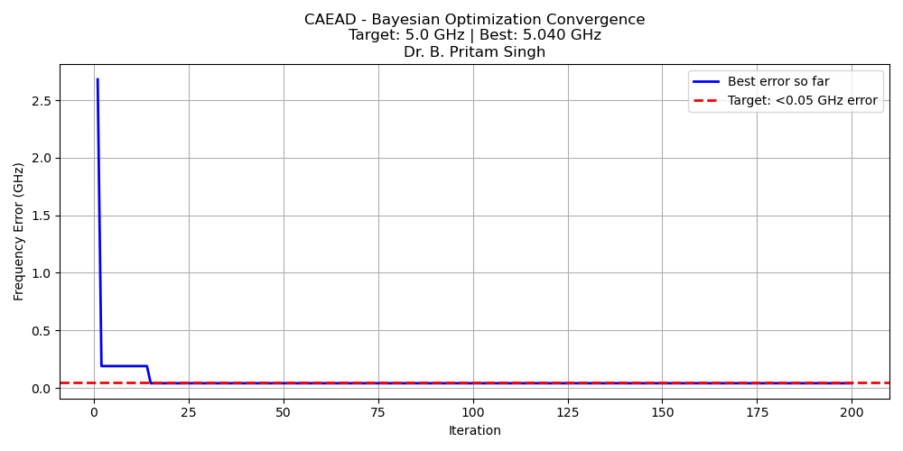

# 📡 CAEAD — Center for AI-Driven Electromagnetics & Antenna Design

**Founder:** Dr. B. Pritam Singh  
**Ph.D.** RF & Microwave Engineering | IIT (ISM) Dhanbad  
**IEEE Member** #92711308 | 14 SCI/SCOPUS Papers | 484 Citations | h-index: 10  

🌐 **Live Demo:** [caead-antenna.streamlit.app](https://caead-antenna.streamlit.app)  
💻 **Code:** [github.com/pritamsingh-antenna/caead2025](https://github.com/pritamsingh-antenna/caead2025)

---

## 🎯 What is CAEAD?

An end-to-end AI-driven antenna design automation system integrating HFSS full-wave simulation with deep learning surrogate models.

**Target:** Replace 2–8 hour HFSS simulations with AI predictions in under 1 second.

> **Phase 1 (Active):** Microstrip Patch Antenna — Sub-6 GHz  
> **Phase 2–4 (Planned):** MIMO Arrays, Horn, Helical, Yagi-Uda, Parabolic

---

## 📊 Validated Results

| Model | R² Score | Notes |
|-------|----------|-------|
| Deep Neural Network (DNN) | **0.9986** | Resonant frequency prediction |
| Gaussian Process Regression (GPR) | **0.9985** | With uncertainty quantification |
| Physics-Informed Neural Network (PINN) | — | Maxwell's equations enforced in loss |
| Ensemble (DNN + GPR + PINN) | **0.9943** | Combined model |
| Bayesian Optimizer | **0.8% error** | Target frequency achieved |
| Inverse Design | WiFi/5G ready | Specs → fabrication geometry |

---

## 🖥️ Dashboard Screenshots

### Forward Design — Geometry → Performance


### Inverse Design — Specs → Geometry


### Dataset Explorer — 5000 Antenna Designs


---

## 📈 Model Results — Plots

### DNN + GPR + PINN Ensemble


### Gaussian Process Regression (GPR) — With Uncertainty


### Physics-Informed Neural Network (PINN)


### Bayesian Optimizer Convergence


---

## 🧠 CAEAD AI Pipeline
```
Target Specifications (Frequency, Bandwidth, Gain, Polarization)
        ↓
Inverse Design Network (specs → geometry)
        ↓
Ensemble Surrogate Model (DNN + GPR + PINN)
        ↓
Bayesian Optimizer (200 iterations, <1 second)
        ↓
Optimized Antenna Geometry (Length, Width, Er, Height)
        ↓
S11 Plot + Design Verification
```

---

## 📡 Dashboard Features (Phase 1)

### Forward Design — Geometry → Performance
- Select feed type: Inset / Edge / Coaxial / Proximity
- Set S11 threshold: −10 / −15 / −20 / −30 dB
- Set bandwidth requirement (MHz)
- Set polarization: Linear / Circular (LHCP/RHCP)
- Get: Resonant frequency, bandwidth, gain, S11 plot, patch geometry visualization

### Inverse Design — Specs → Geometry
- Enter target frequency, bandwidth, gain
- Quick presets: WiFi 2.4 GHz, WiFi 5 GHz, 5G Sub-6, GPS L1
- Get: Patch dimensions, substrate recommendation, feed implementation guide

### Dataset Explorer
- 5000 antenna design dataset
- Interactive scatter plots across all parameters

---

## 🗂️ Repository Structure
```
caead2025/
├── hello_caead.py              # Project start
├── s11_basic.py                # S11 simulation — single patch
├── antenna_dataset.py          # 20 designs dataset
├── caead_ml_model.py           # DNN surrogate — 500 designs
├── caead_dataset_5000.py       # 5000 designs — 6 parameters
├── caead_ml_v2.py              # DNN v2 — multi-output (freq, BW, gain)
├── caead_optimizer.py          # Bayesian Optimizer
├── caead_inverse_design.py     # Inverse design network
├── caead_pinn.py               # Physics-Informed Neural Network
├── caead_gpr.py                # Gaussian Process Regression
├── caead_ensemble.py           # Ensemble (DNN + GPR + PINN)
├── caead_dashboard.py          # Streamlit dashboard (main app)
├── caead_hfss_design.py        # PyAEDT HFSS integration (Phase 1 production)
├── caead_500_designs.csv       # 500-point dataset
├── caead_5000_designs.csv      # 5000-point dataset
└── requirements.txt            # Dependencies
```

---

## 🚀 Run Locally
```bash
git clone https://github.com/pritamsingh-antenna/caead2025.git
cd caead2025
pip install -r requirements.txt
streamlit run caead_dashboard.py
```

---

## 📈 Development Roadmap

| Phase | Antenna Types | Data Source | Status |
|-------|--------------|-------------|--------|
| Phase 1 | Microstrip Patch (Rectangular) | Synthetic + HFSS validation | 🟢 Active |
| Phase 2 | MIMO Arrays, Slot, Circular Patch | HFSS PyAEDT automation | 🔜 Planned |
| Phase 3 | Horn, Helical, Vivaldi, UWB | HFSS 50K+ dataset | 🔜 Planned |
| Phase 4 | Yagi-Uda, Parabolic, Log-Periodic | Multi-tool simulation | 🔜 Planned |

---

## 🔭 Next Steps

- [ ] PyAEDT integration — real HFSS simulation data (replacing synthetic)
- [ ] 50,000 design dataset via Latin Hypercube Sampling (LHS)
- [ ] Conditional Variational Autoencoder (cVAE) for topology generation
- [ ] IEEE TAP/APS paper submission
- [ ] Indian Patent Office filing (IPC: H01Q 1/36, G06N 3/08, G06F 30/20)

---

## ⚠️ Important Note

Phase 1 dataset is based on simplified analytical formula:  
`f₀ = c / (2L√εᵣ)`  

This is a **proof of concept**. Production release will use real HFSS simulation data via PyAEDT automation pipeline.

---

## 📚 Tech Stack

| Category | Tools |
|----------|-------|
| EM Simulation | ANSYS HFSS, CST Studio Suite |
| ML Framework | Scikit-learn, PyTorch (PINN) |
| Optimization | Bayesian Optimization, SciPy |
| Deployment | Streamlit Cloud |
| Automation | Python, PyAEDT |
| Data | NumPy, Pandas, HDF5 |

---

*CAEAD — Building the future of electromagnetic design with AI*  
*Dr. B. Pritam Singh | IIT (ISM) Dhanbad | pritam.gs@gmail.com*